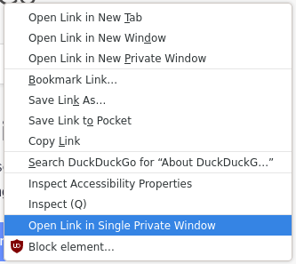

In Firefox, while browsing in a regular window, requesting to open a
link in a private (incognito) window causes a new browser window to be
created every time. By contrast, Chrome opens links as new tabs in an
*existing* private window, only creating one if there is none.

This Firefox add-on emulates the behaviour in Chrome. It adds an entry
"Open Link in Single Private Window" in the context menu for
links. When selected, this opens the link in a new tab in a private
window.

***To properly work, this extension must be allowed to run in private
windows.***

